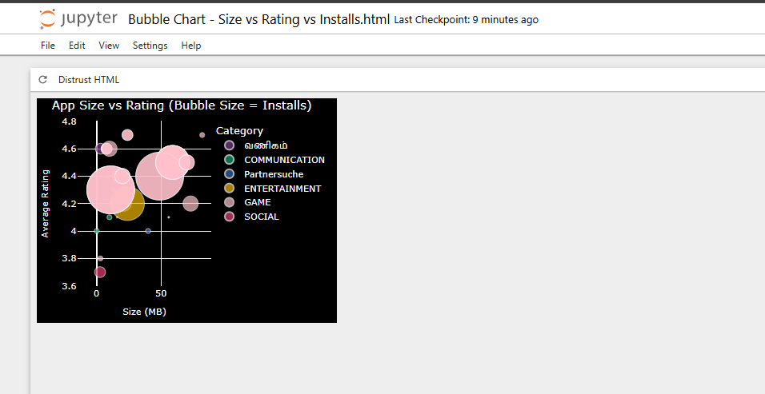

# Google Play Store Data Analytics — Internship Project

## Overview
This project analyzes the Google Play Store apps dataset along with user reviews to uncover insights about app performance, ratings, installs, sentiment, and category trends. It was built as part of the ElevanceSkills Data Analyst Internship, extending the training project with additional dashboard tasks.

## Dataset
- `googleplaystore.csv` — App-level data (category, rating, size, installs, price, etc.)
- `user_reviews.csv` — User reviews with sentiment polarity and subjectivity scores

## What This Project Does
- Cleans and preprocesses raw app and review data (handling missing values, duplicates, data type conversions)
- Converts app size, installs, and price into usable numeric formats
- Performs sentiment analysis on user reviews using NLTK's VADER
- Merges app data with review sentiment for deeper analysis
- Builds interactive Plotly visualizations, including:
  - Top categories on the Play Store
  - **Bubble chart**: App Size vs Rating, with bubble size representing Installs — filtered by rating, category, reviews, sentiment subjectivity, and installs, with the Game category highlighted in pink and select category labels translated (Hindi, Tamil, German)
- Exports visualizations as an interactive HTML dashboard

## Tech Stack
- Python, Pandas, NumPy
- Plotly Express (visualizations)
- NLTK (VADER sentiment analysis)
- scikit-learn

## How to Run
1. Clone this repository
2. Install dependencies:

pip install pandas numpy plotly nltk scikit-learn pytz

3. Open `Analysis.ipynb` in Jupyter Notebook / JupyterLab
4. Run all cells from top to bottom
5. The generated dashboard HTML file(s) will be saved in the same folder

## Author
Pratham Saini — Data Analyst Intern, ElevanceSkills
